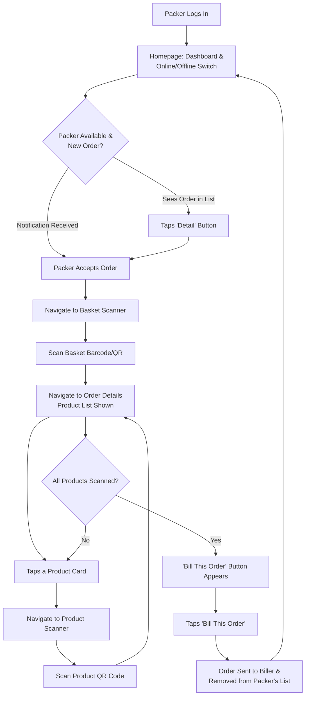
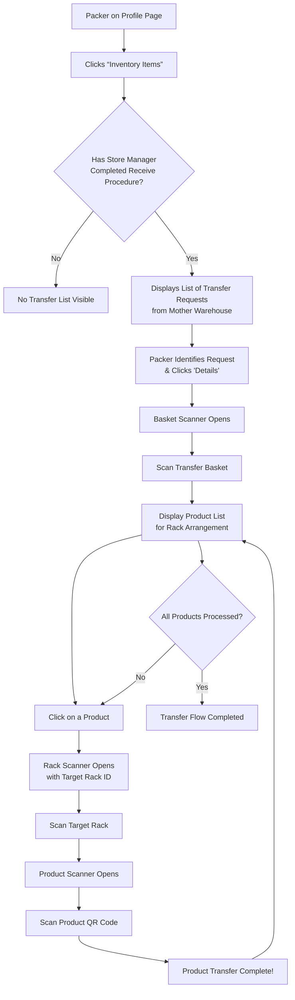
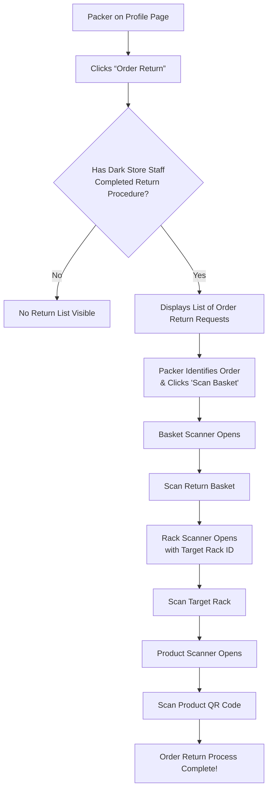
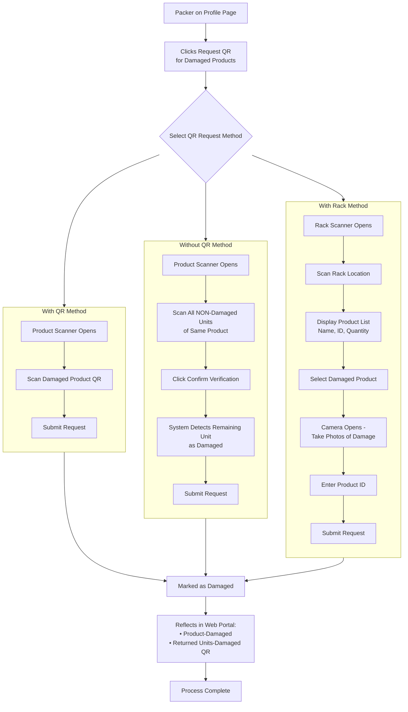

# Dark Store Packer Flow

Doc provided by QA: https://docs.google.com/document/d/1KmzGY6SG5NedOaMDS3dP3KLyqgHcBMY59H6zU_7m_Sk/edit?usp=sharing

## Normal Order Flow

## Inventory Items

## Order Return

## Request QR

