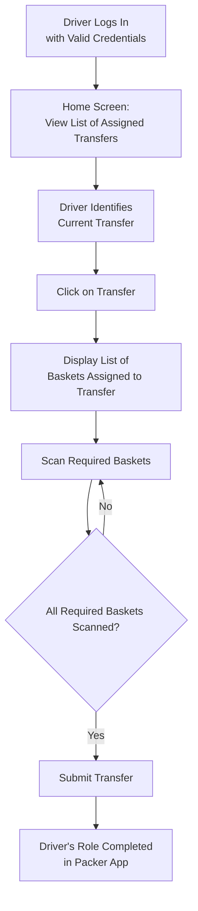

# Driver Flow chart

```mermaid
flowchart TD
    A[Driver Logs In<br>with Valid Credentials] --> B[Home Screen:<br>View List of Assigned Transfers]

    B --> C[Driver Identifies<br>Current Transfer]
    C --> D[Click on Transfer]
    D --> E[Display List of<br>Baskets Assigned to Transfer]

    E --> F[Scan Required Baskets]
    F --> G{All Required Baskets Scanned?}
    G -->|No| F
    G -->|Yes| H[Submit Transfer]

    H --> I[Driver's Role Completed<br>in Packer App]

```
