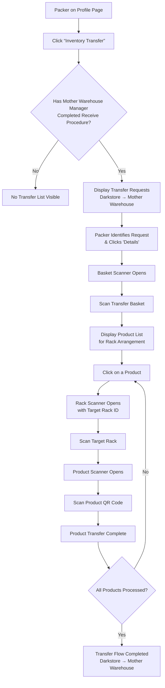
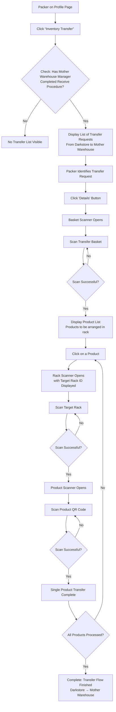
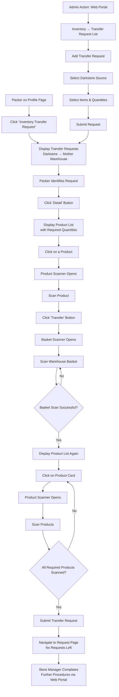
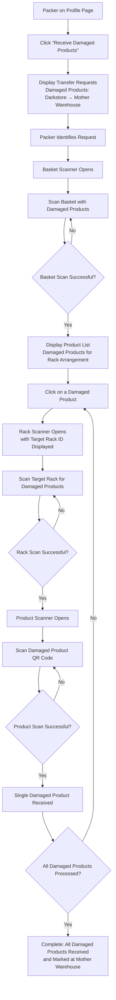
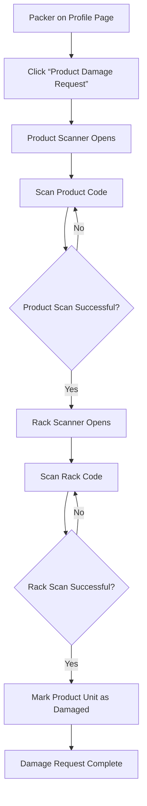

# Dark Warehouse Packer

```mermaid
flowchart TD
    A[App Opens: Home Warehouse Screen] --> B[View Store List with Low Stock Items]
    B --> C[Click 'Details' Button on Product Card]
    C --> D[View Remaining Product Count to Transfer]
    D --> E[Click on Product Card]
    E --> F[Scan Carton Barcode/QR]
    F --> G{Scan Successful?}
    G -->|No| F
    G -->|Yes| H[App Identifies Product ID from Carton]
    H --> I[Navigate to Product Scanner Screen]
    I --> J[Scan Required Products]
    J --> K[Navigate Back to Home Page]

    K --> L[Click Trolley Icon<br>Top Right Corner]
    L --> M[View Scanned Products by Store<br>Product Count & Details Button]
    M --> N[Click Details Button on Store Card]
    N --> O[Basket Scanner Opens]
    O --> P[Scan Transfer Basket]
    P --> Q{Scan Successful?}
    Q -->|No| P
    Q -->|Yes| R[Product Scanner Opens]
    R --> S[Scan Product Tags]
    S --> T{All Tags Scanned?}
    T -->|No| S
    T -->|Yes| U[Navigate Back to Trolley Screen]
    U --> V[Transfer Reflected in<br>Warehouse Staff Web Portal]
```

## Inventory Transfer

```mermaid
flowchart TD
    A[Packer on Profile Page] --> B[Click “Inventory Transfer”]

    B --> C{Has Mother Warehouse Manager<br>Completed Receive Procedure?}

    C -->|No| D[No Transfer List Visible]
    C -->|Yes| E[Display Transfer Requests<br>Darkstore → Mother Warehouse]

    E --> F[Packer Identifies Request<br>& Clicks 'Details']
    F --> G[Basket Scanner Opens]
    G --> H[Scan Transfer Basket]
    H --> I[Display Product List<br>for Rack Arrangement]

    I --> J[Click on a Product]
    J --> K[Rack Scanner Opens<br>with Target Rack ID]
    K --> L[Scan Target Rack]
    L --> M[Product Scanner Opens]
    M --> N[Scan Product QR Code]
    N --> O[Product Transfer Complete]

    O --> P{All Products Processed?}
    P -->|No| J
    P -->|Yes| Q[Transfer Flow Completed<br>Darkstore → Mother Warehouse]

```

## Inventory Transfer request

```mermaid
flowchart TD
    A[Packer on Profile Page] --> B[Click “Inventory Transfer”]

    B --> C{Check: Has Mother Warehouse Manager<br>Completed Receive Procedure?}

    C -->|No| D[No Transfer List Visible]
    C -->|Yes| E[Display List of Transfer Requests<br>From Darkstore to Mother Warehouse]

    E --> F[Packer Identifies Transfer Request]
    F --> G[Click 'Details' Button]
    G --> H[Basket Scanner Opens]
    H --> I[Scan Transfer Basket]
    I --> J{Scan Successful?}
    J -->|No| I
    J -->|Yes| K[Display Product List<br>Products to be arranged in rack]

    K --> L[Click on a Product]
    L --> M[Rack Scanner Opens<br>with Target Rack ID Displayed]
    M --> N[Scan Target Rack]
    N --> O{Scan Successful?}
    O -->|No| N
    O -->|Yes| P[Product Scanner Opens]
    P --> Q[Scan Product QR Code]
    Q --> R{Scan Successful?}
    R -->|No| Q
    R -->|Yes| S[Single Product Transfer Complete]

    S --> T{All Products Processed?}
    T -->|No| L
    T -->|Yes| U[Complete: Transfer Flow Finished<br>Darkstore → Mother Warehouse]
```

## Inventory Transfer request

```mermaid
flowchart TD
    A[Packer on Profile Page] --> B[Click “Inventory Transfer Request”]
    B --> C[Display Transfer Requests<br>Darkstore → Mother Warehouse]

    Admin[Admin Action: Web Portal] --> D[Inventory → Transfer Request List]
    D --> E[Add Transfer Request]
    E --> F[Select Darkstore Source]
    F --> G[Select Items & Quantities]
    G --> H[Submit Request]
    H --> C

    C --> I[Packer Identifies Request]
    I --> J[Click 'Detail' Button]
    J --> K[Display Product List<br>with Required Quantities]

    K --> L[Click on a Product]
    L --> M[Product Scanner Opens]
    M --> N[Scan Product]
    N --> O[Click 'Transfer' Button]
    O --> P[Basket Scanner Opens]
    P --> Q[Scan Warehouse Basket]
    Q --> R{Basket Scan Successful?}
    R -->|No| Q
    R -->|Yes| S[Display Product List Again]

    S --> T[Click on Product Card]
    T --> U[Product Scanner Opens]
    U --> V[Scan Products]
    V --> W{All Required Products Scanned?}
    W -->|No| T
    W -->|Yes| X[Submit Transfer Request]

    X --> Y[Navigate to Request Page<br>No Requests Left]
    Y --> Z[Store Manager Completes<br>Further Procedures via Web Portal]
```

## Receive Damage Product

```mermaid
flowchart TD
    A[Packer on Profile Page] --> B[Click “Receive Damaged Products”]
    B --> C[Display Transfer Requests<br>Damaged Products: Darkstore → Mother Warehouse]

    C --> D[Packer Identifies Request]
    D --> E[Basket Scanner Opens]
    E --> F[Scan Basket with Damaged Products]
    F --> G{Basket Scan Successful?}
    G -->|No| F
    G -->|Yes| H[Display Product List<br>Damaged Products for Rack Arrangement]

    H --> I[Click on a Damaged Product]
    I --> J[Rack Scanner Opens<br>with Target Rack ID Displayed]
    J --> K[Scan Target Rack for Damaged Products]
    K --> L{Rack Scan Successful?}
    L -->|No| K
    L -->|Yes| M[Product Scanner Opens]
    M --> N[Scan Damaged Product QR Code]
    N --> O{Product Scan Successful?}
    O -->|No| N
    O -->|Yes| P[Single Damaged Product Received]

    P --> Q{All Damaged Products Processed?}
    Q -->|No| I
    Q -->|Yes| R[Complete: All Damaged Products Received<br>and Marked at Mother Warehouse]
```

## Product Damage Request

```mermaid
flowchart TD
    A[Packer on Profile Page] --> B[Click “Product Damage Request”]
    B --> C[Product Scanner Opens]

    C --> D[Scan Product Code]
    D --> E{Product Scan Successful?}
    E -->|No| D
    E -->|Yes| F[Rack Scanner Opens]

    F --> G[Scan Rack Code]
    G --> H{Rack Scan Successful?}
    H -->|No| G
    H -->|Yes| I[Mark Product Unit as Damaged]

    I --> J[Damage Request Complete]
```
